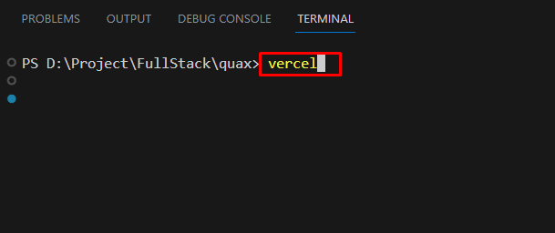
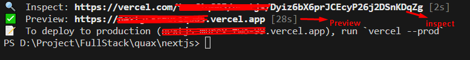

# Introduction

Welcome to the Quax documentation!

### Supported Platforms For Local Development

```    
Compatible Browsers (Firefox, Safari, Chrome, Edge)
Server(Node.js 18.16.0)
MacOS, Windows, and Linux are supported
```

### Requirements

```
node(18.16.0)
npm
editor: Visual Studio Code(recommended)
```

### Tech We Have Used

```
NextJs
React
Javascript
Tailwind
Framer Motion
Font Awesome
```

### Getting Started & Installation

>Make sure you moved the quax-react folder to a generic folder like Desktop, Document, or your
specific code folder. Otherwise, the top folder name causes several path issues in generating the
schema or installing npm packages

For getting started with the template you have to follow the below procedure. First navigate to the root
directory. Then run below command for getting started with specific part

# on root directory

```
npm install
npm run build
npm run start
```

Available Scripts: You can run below commands in the root folder for your need.

```
"dev": "next dev",
"build": "next build",
"start": "next start",
"lint": "next lint"
```

For customizing the template's default site settings:

### For Each Pages

```
src/data/pages/
about.js
blog.js
home-one.js
home-two.js
home-three.js
service-details.js
service.js
team-members-details.js
team-members.js
```
### For Each Sections

```
src/data/section/
blog-post.js
blog-section.js
case-study.js
home-blogpost.js
pricing-section.js
service.js
team-member.js
testimonial.js
```

### For API Part

```
src/pages/api/
```
### For static data

```
src/components/
Buttons
Footer
Navbar
Sections
Testimonial
ui
and many more
```

# Deployment

## Vercel

>[your-frontend-project]

[Vercel](https://vercel.com)

If you want to host the template in vercel.com then follow the below command

#### Step 1:

Install vercel-cli

```
npm install -g vercel
```


For updating vercel-cli
```
npm install -g vercel@latest
```

#### Step 2:

Navigate to quax-react and run below command

```
npm install
```


#### Step 3:
Now run below command

```
npm run build
```


#### Step 4:

Now run below command

```
vercel init
```


select **nextjs** using up and down arrow and press enter to continue


#### Step 5:

Now run below command

```
cd nextjs
```


#### Step 6:

Now run below command

And then continue with the process

```
vercel
```


After you will see this following screen

You can preview the template from the preview link



#### Step 7:

Now run this final command

```
vercel --prod
```


You can get the production link from hear


Congratulations! You have successfully deployed the template.

### Importent Links


Vercel
[Documentation](https://vercel.com/docs)

Basic Features
[How Next js works](https://nextjs.org/learn/foundations/how-nextjs-works)

For Routing
[Next js docs](https://nextjs.org/docs/pages/building-your-application/routing)

## FAQ

Can I export this template as HTML?

>NextJS scripts require a server to handle its build process and deliver its content. It's not possible to
export the template as raw HTML.